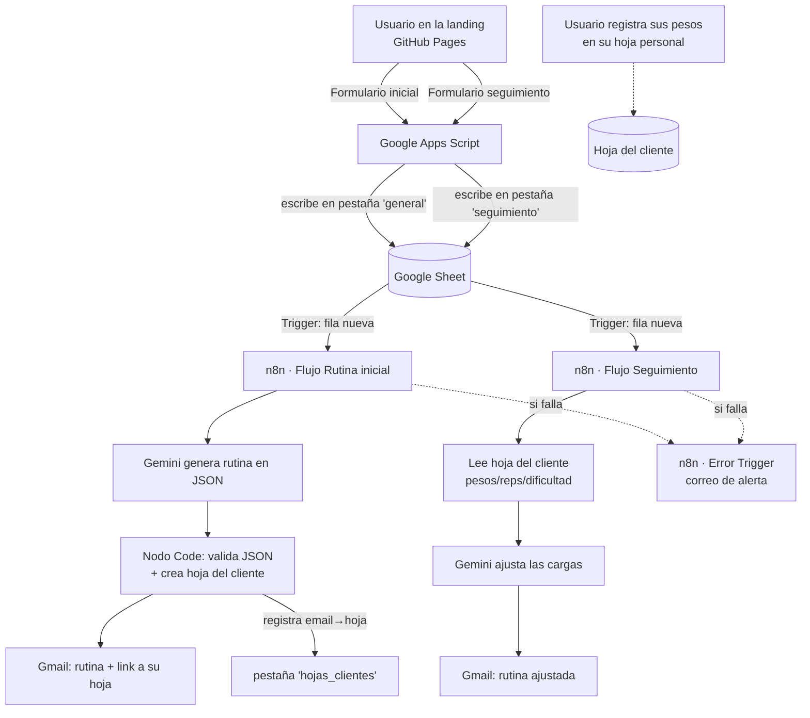
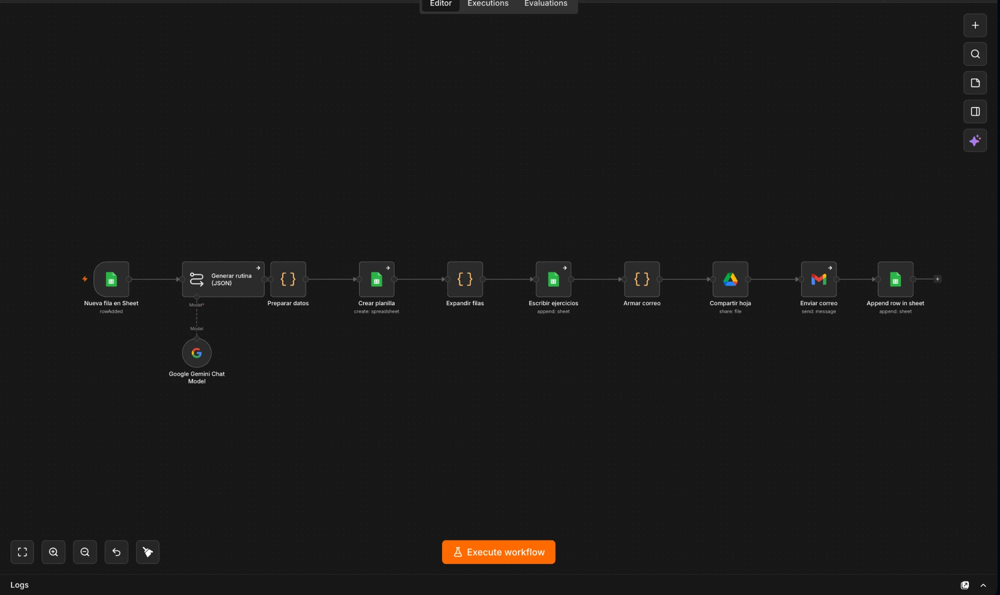
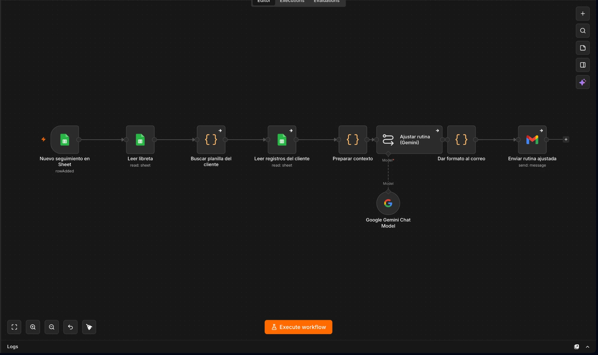
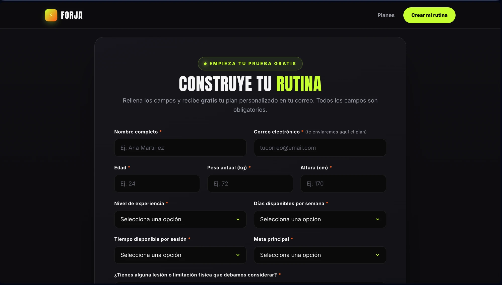
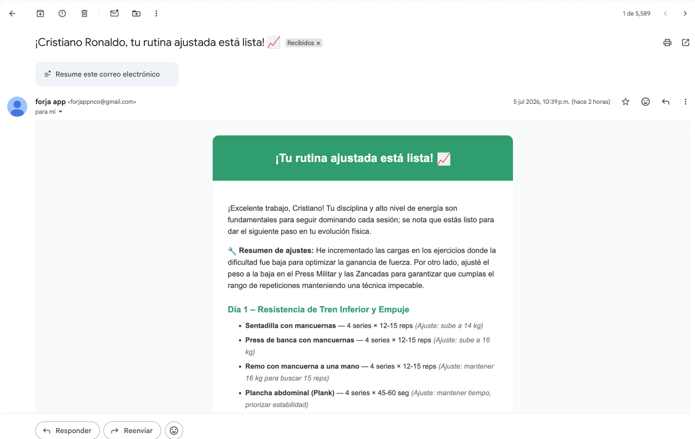

# FORJA — Generador y seguimiento de rutinas de gimnasio con IA

> Proyecto Final · Automatización e IA para MVPs · MBA UAI · 2026-1S
> **Track B — Producto propio (MVP)**

FORJA es un producto que, a partir de un formulario, genera una **rutina de gimnasio personalizada con IA**, la entrega por correo junto con una **hoja de seguimiento** donde el usuario registra sus pesos, y luego **ajusta automáticamente las cargas** según su progreso real.

**🎥 Video demo (5 min):** https://www.youtube.com/watch?v=nHguDA1Ad2c

---

## 1 · Identificación

- **Grupo:** FORJA
- **Integrantes:** Javier Venegas · Raimundo Bravo · Tomás Núñez · Zhen Chi
- **Track:** B — Producto propio
- **Tipo declarado:** MVP (producto propio con modelo de negocio freemium)

---

## 2 · Resumen ejecutivo

Construimos **FORJA**, un MVP que resuelve la parálisis del principiante en el gimnasio: recibe los datos de la persona por un formulario web, un LLM (Google Gemini) genera una rutina personalizada, y el sistema la envía por correo junto con una hoja de cálculo para registrar su desempeño. Cuando el usuario vuelve y pide un seguimiento, la IA **lee los pesos y la dificultad reales** que registró y **ajusta la rutina** para que siga progresando. La métrica que mueve el producto es la **retención vía seguimientos completados**.

---

## 3 · Problema y solución

**El dolor:** quien empieza en el gimnasio no sabe qué rutina seguir, se siente perdido e intimidado, y un personal trainer es caro (fácilmente $150.000–$200.000 CLP/mes). Además, la mayoría de las rutinas "gratis" de internet son genéricas y no evolucionan con la persona.

**La solución:** FORJA entrega una rutina personalizada gratis en minutos y, sobre todo, **cierra el loop de mejora**: el usuario registra sus pesos y la IA reajusta las cargas. Es como tener un entrenador que recuerda tu progreso, por una fracción del costo.

**Por qué la elegimos:** combina un dolor real y masivo (principiantes de gym) con un caso ideal para IA + automatización (personalización a escala y ajuste continuo basado en datos).

---

## 4 · Arquitectura

**Flujo de datos resumido:** el formulario web escribe en Google Sheets → n8n se dispara con cada fila nueva → Gemini genera/ajusta la rutina → se crea/lee la hoja de seguimiento del cliente → el resultado llega por correo. Un flujo de Error Trigger vigila y avisa si algo falla.

**Flujo de rutina inicial en n8n:**

**Flujo de seguimiento en n8n:**

---

## 5 · Las 4 verticales

| Vertical | Capa cumplida | Evidencia |
|---|---|---|
| **Automatización** | Capa 1 | [`/src/flujo/`](src/flujo/). Gatillo por fila nueva (Google Sheets Trigger) y los 3 mecanismos de error: **Retries** + **Continue on Fail** ([captura](evidencia/03-retry-continue.png)) y **Error Trigger** ([flujo](evidencia/04-error-trigger.png) · [configurado como Error Workflow](evidencia/04b-error-workflow-settings.png)). |
| **IA** | Capa 1 | [`/src/prompts/`](src/prompts/). Llamada a Gemini integrada al flujo; el resultado se usa para crear la hoja y el correo. Como refuerzo, la IA devuelve **JSON que se valida en un nodo Code** (guardrail) antes de usarse. *(La Capa 2 de IA —agente con herramientas / multi-agente / RAG— no está implementada.)* |
| **BBDD** | Capa 1 | Google Sheet con pestañas [`general`](evidencia/05-sheet-general.png), [`hojas_clientes`](evidencia/05b-hojas-clientes.png) y [`seguimiento`](evidencia/05c-seguimiento.png) + una hoja por cliente. Estructura en [`/src/bbdd/estructura.md`](src/bbdd/estructura.md). |
| **Front / Touchpoint** | Capa 1 (+ Capa 2) | Landing propia publicada (§6, [captura](evidencia/06-landing.png)). **Capa 2:** UI propia funcional construida con IDE agéntico, con 2 formularios integrados al backend. |

---

## 6 · Touchpoint del usuario

- **Qué la gatilla:** el usuario entra a la landing pública y rellena un formulario (inicial o de seguimiento).
- **Por qué canal:** web (GitHub Pages), sin instalar nada, accesible desde móvil.
- **Dónde recibe el resultado:** por **correo electrónico**, unos segundos después. La rutina inicial incluye un **link a su hoja de seguimiento** editable.
- **Landing en vivo:** https://zhenwchi7-source.github.io/forja-rutinas/

**Ejemplo del resultado — correo con la rutina ajustada según los datos reales del cliente:**

---

## 7 · Cómo correrlo

**Requisitos:** cuenta de Google (Sheets + Gmail), n8n (cloud), API key de Google Gemini (gratis en [aistudio.google.com/apikey](https://aistudio.google.com/apikey)).

1. **Landing:** `index.html` se publica en GitHub Pages. Los formularios envían a un Google Apps Script (`/src/apps-script/doPost.gs`) que escribe en el Google Sheet.
2. **Google Sheet:** crea las pestañas `general`, `seguimiento` y `hojas_clientes` con los encabezados indicados en `/src/bbdd/estructura.md`.
3. **n8n:** importa los 3 flujos de `/src/flujo/`. En cada uno, conecta las credenciales (Google Sheets, Google Drive, Gmail, Gemini) y selecciona el documento/hoja.
4. **Activa** los 3 workflows. Prueba enviando los formularios de la landing.

Credenciales: se conectan vía OAuth "Sign in with Google" dentro de n8n (no se versionan secretos en el repo).

---

## 8 · Track B — Viabilidad

### Problema y usuario objetivo
Principiantes y "retomadores" de gimnasio (18–35 años principalmente) que no saben qué rutina seguir, no pueden pagar un personal trainer y abandonan por falta de guía y progreso visible.

### Análisis competitivo — 5 Fuerzas de Porter
- **Rivalidad (media-alta):** apps de fitness (Fitbod, Freeletics, Hevy), rutinas de YouTube/Instagram, planillas gratis. Nos diferencia el **ajuste automático por datos reales** y la simplicidad (sin app que instalar).
- **Amenaza de nuevos entrantes (alta):** montar un generador con IA es barato hoy; la barrera real es la marca, la comunidad y la data de progreso acumulada.
- **Poder de proveedores (medio):** dependemos de APIs de LLM (Gemini/OpenAI); riesgo de precios/límites, mitigable cambiando de modelo.
- **Poder de compradores (alto):** hay muchas alternativas gratis; por eso el modelo parte gratis y cobra solo el seguimiento continuo.
- **Sustitutos (alto):** personal trainer, gimnasio con asesoría, simplemente rendirse. Competimos en precio y conveniencia.

**Referentes identificados:** Hevy, Caliverse y Fitbod.

### FODA
- **Fortalezas:** personalización real + loop de ajuste por datos; costo casi nulo de operación; onboarding sin fricción (solo un formulario).
- **Oportunidades:** boom del fitness y de la IA; mercado LATAM desatendido en español; upsell a nutrición.
- **Debilidades:** sin app nativa; depende de que el usuario registre sus pesos; marca inexistente.
- **Amenazas:** competidores grandes con más recursos; cambios de precio de las APIs de IA; usuarios que no vuelven.

### Prueba de demanda — conversaciones con usuarios
Entrevistamos a potenciales usuarios (evidencia en [`/evidencia/conversaciones/`](evidencia/conversaciones/)). Les preguntamos: (1) cómo eligen su rutina y qué les frustra sin un plan, (2) si han pagado o pagarían por un personal trainer y cuánto, (3) si usarían una rutina personalizada gratis, y (4) si pagarían **$4.990/mes** por una IA que registra sus pesos y les dice cuándo subirlos.

**Hallazgos (5 entrevistas realizadas):**

- **Uso del plan gratis: 5 de 5** usarían la rutina personalizada gratuita.
- **Disposición a pagar el plan Pro: 5 de 5** dijeron que pagarían los $4.990/mes; lo describieron como *"buen precio"*, *"accesible"* y *"un precio razonable… comparando con los precios de un personal trainer"*. Valida el punto de precio elegido.
- **Barrera del personal trainer confirmada:** solo 1 de 5 había pagado por uno (≈$45.000 por 3 meses); los demás nunca pagaron aunque *"lo han considerado"* → confirma el hueco de precio que FORJA llena.
- **Motor de valor #1 — ver el progreso / llevar el ritmo:** *"es muy útil ver cómo es el progreso semana a semana con los pesos"* (Rafa); *"saber cómo voy con el ritmo en el gym"* (Marcelo); *"cuando voy al gimnasio no tengo anotado el progreso que voy logrando"* (Persona 5). Es el hallazgo más repetido y valida directamente el loop de seguimiento.
- **Motor de valor #2 — ahorrar tiempo:** *"uno pierde tiempo pensando qué hacer; una rutina establecida te ahorra tiempo y te permite llevar registro de tu progreso"* (Sebacho).
- **Motor de valor #3 — descubrir ejercicios nuevos:** *"me ayudaría bastante en recomendarme ejercicios personales que no conozco"* (Ignacio).
- **El mercado es más amplio de lo previsto:** incluso un usuario avanzado (entrena desde los 14, estudió kinesiología) ve valor para *"potenciar el rendimiento y maximizar el tiempo invertido en el gimnasio"* → el producto sirve más allá del principiante.
- **Insight de riesgo (credibilidad):** un entrevistado condiciona su uso a que la información sea *"basada en la evidencia"* → la credibilidad científica es un factor clave y un punto a reforzar (respaldo/guardrails).

### Modelo de negocio
- **Freemium:** plan **Prueba** gratis (rutina inicial + 1 seguimiento) y plan **FORJA Pro** a **$4.990 CLP/mes** (seguimientos ilimitados, progresión automática, historial, cambio de meta, soporte).
- **Racional:** el valor recurrente está en el seguimiento continuo; lo gratis sirve de gancho y prueba de valor.

### Métrica north-star
**Nº de seguimientos completados por usuario al mes.** Mide a la vez retención, valor entregado y disposición a pagar (quien hace seguimiento recurrente es quien convierte a Pro).

### Roadmap
1. Validar conversión gratis→Pro con usuarios reales.
2. Recordatorios automáticos para registrar pesos (aumentar la tasa de seguimiento).
3. Historial de progreso visual + gráficos.
4. Integración de pago (Mercado Pago / Stripe) y onboarding de la suscripción.
5. App móvil ligera o PWA.

---

## 9 · Limitaciones y próximos pasos

- El seguimiento depende de que el usuario **registre sus pesos** en la hoja; sin datos, el ajuste se basa solo en su feedback general.
- El disparador de Google Sheets **no es instantáneo** (revisa ~cada minuto).
- Aún **no hay cobro real** de la suscripción (el modelo está definido pero no integrado con un proveedor de pagos).
- La hoja del cliente se comparte como "cualquiera con el link puede editar" (simple para el MVP; a futuro, acceso por usuario).
- Con más tiempo: recordatorios, gráficos de progreso, integración de pagos y autenticación.

---

## 10 · Roles del equipo

| Integrante | Responsabilidad principal |
|---|---|
| Javier Venegas | Landing / Front |
| Raimundo Bravo | BBDD, integración con Google y Track B |
| Tomás Núñez | BBDD, integración con Google y Track B |
| Zhen Chi | Automatización (n8n), integración de IA (Gemini) y QA/validación end-to-end |

---

*Repositorio del Proyecto Final · FORJA · MBA UAI 2026-1S*
